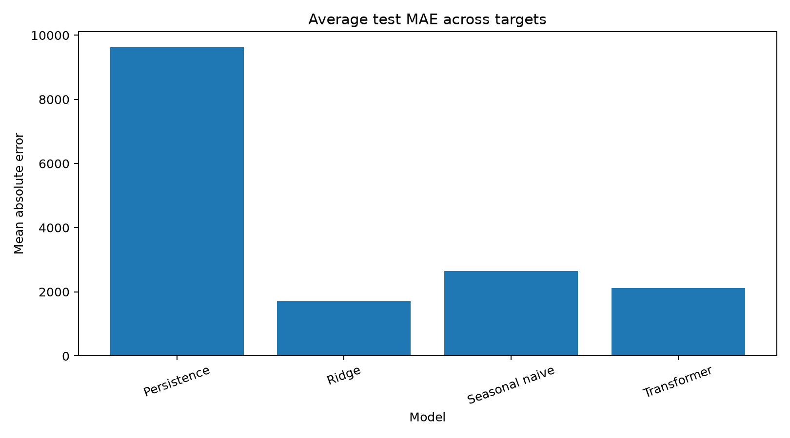
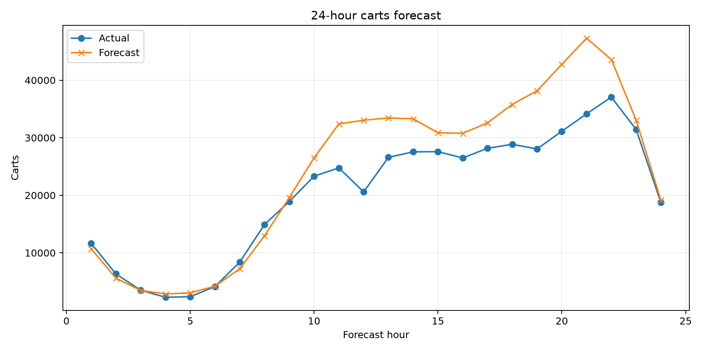
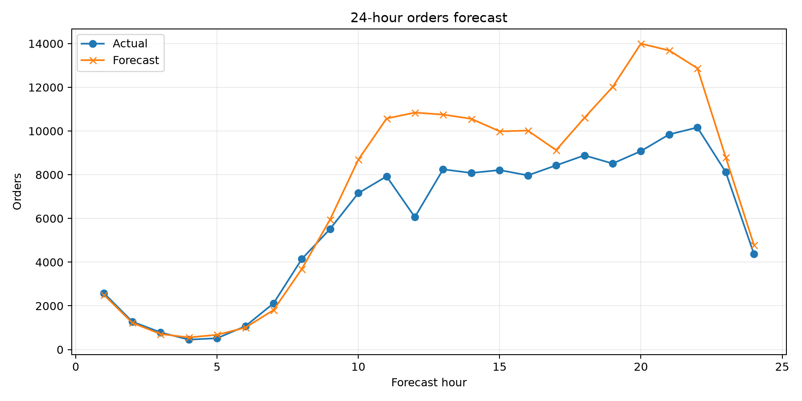

<div align="center">

# OTTO E-commerce Demand Forecasting

### Leakage-aware, multi-horizon forecasting of cart and order demand from 220M+ clickstream events

[](https://github.com/nikchey29/otto-demand-forecasting/actions/workflows/ci.yml)


A production-style machine-learning system that converts the OTTO Recommender Systems clickstream dataset into an hourly operational time series and forecasts **cart and order volume for the next 24 hours**.

</div>

---

## Executive summary

This project demonstrates the complete lifecycle of a forecasting system:

- Streams and aggregates **220M+ raw e-commerce events** without loading the full dataset into memory
- Builds leakage-aware chronological train, validation, and test windows
- Engineers cyclical temporal features and applies training-only preprocessing
- Benchmarks a compact PyTorch Transformer against Ridge, seasonal-naive, and persistence baselines
- Evaluates all models in original event-count units using MAE, RMSE, WAPE, sMAPE, MAPE, and horizon-level error
- Saves reproducible artifacts, predictions, metrics, and plots
- Exposes trained forecasts through a FastAPI service
- Includes automated tests, Docker support, packaging, and continuous integration

The final experiment showed that **Ridge achieved the best overall MAE**, while the **Transformer achieved the lowest order-volume MAE**. This result highlights an important engineering lesson: model complexity should be justified by measured performance, not assumed superiority.

---

## Results

All models were evaluated on the same isolated chronological test windows after predictions were converted back to original event-count units.

| Model | Carts MAE | Orders MAE | Average MAE |
|---|---:|---:|---:|
| **Ridge** | **2,338.53** | 1,086.99 | **1,712.76** |
| Transformer | 3,194.64 | **1,042.02** | 2,118.33 |
| Seasonal naive | 4,064.79 | 1,243.96 | 2,654.37 |
| Persistence | 14,658.26 | 4,608.62 | 9,633.44 |

### Key findings

- Ridge produced the **best overall average MAE**
- The Transformer reduced **order MAE by 4.1%** compared with Ridge
- The Transformer reduced average MAE by **20.2%** compared with seasonal-naive forecasting
- The Transformer reduced average MAE by **78.0%** compared with persistence forecasting
- Ridge achieved **9.29% carts WAPE**
- The Transformer achieved the strongest **orders WAPE at 14.30%**

<p align="center">
  
</p>

<p align="center">
  
  
</p>

> The results show that the shorter aggregated time series favors a regularized linear model overall, while the Transformer captures additional structure in order-volume forecasting.

---

## Why this project is technically strong

### Large-scale data processing

The OTTO dataset contains hundreds of millions of clickstream events. The pipeline processes the JSONL file incrementally instead of loading it entirely into memory, then aggregates clicks, carts, and orders into hourly operational demand.

### Leakage-aware forecasting design

Time-series leakage is controlled through:

- Chronological train, validation, and test periods
- Forecast windows whose targets remain fully inside their assigned split
- Feature and target scalers fitted only on the training period
- Test evaluation performed only after model selection
- Original-scale metric calculation after inverse transformation

### Baseline-first experimentation

The Transformer is evaluated against three meaningful baselines:

- **Persistence:** repeats the most recent observed demand
- **Seasonal naive:** repeats demand from the corresponding previous seasonal period
- **Ridge regression:** provides a regularized linear forecasting benchmark

This prevents the neural model from being evaluated in isolation and makes the final conclusions more credible.

### Production-oriented engineering

The repository includes:

- Config-driven training
- Reusable Python modules
- Saved model and preprocessing artifacts
- FastAPI inference endpoints
- Docker support
- Automated tests
- GitHub Actions continuous integration
- Model documentation and limitations
- Reproducible metrics and visual outputs

---

## System architecture

```text
                         OTTO JSONL
                              |
                              v
                 Streaming event aggregation
                              |
                              v
              UTC reindexing + missing-hour filling
                              |
                              v
                  Temporal feature engineering
                              |
                              v
          Chronological train / validation / test split
                              |
                 +------------+------------+
                 |                         |
                 v                         v
        PyTorch Transformer          Forecast baselines
                                     - Persistence
                                     - Seasonal naive
                                     - Ridge
                 |                         |
                 +------------+------------+
                              |
                              v
             Original-scale evaluation and reporting
                              |
                              v
       Metrics + plots + model artifacts + FastAPI service
```

---

## Forecasting formulation

Each training example uses:

- **Lookback window:** 168 hourly observations
- **Forecast horizon:** 24 future hours
- **Targets:** cart volume and order volume
- **Input features:** click, cart, and order history plus engineered temporal features

The Transformer:

1. Projects the input features into a compact latent representation
2. Adds positional information
3. Applies two Transformer encoder blocks
4. Mean-pools the temporal sequence
5. Produces a direct `24 × 2` multi-horizon forecast

Target counts are transformed using `log1p`, standardized with training-only statistics, and converted back to non-negative event counts for evaluation and serving.

---

## Tech stack

| Area | Technologies |
|---|---|
| Language | Python 3.11+ |
| Deep learning | PyTorch |
| Classical ML | scikit-learn |
| Data processing | pandas, NumPy |
| API | FastAPI, Uvicorn |
| Testing | pytest |
| Code quality | Ruff |
| Packaging | `pyproject.toml` |
| Deployment | Docker |
| Automation | GitHub Actions |

---

## Repository structure

```text
.
├── .github/workflows/       # Continuous integration
├── artifacts/               # Metrics, plots, and saved outputs
├── configs/                 # Experiment configuration
├── data/
│   ├── processed/           # Aggregated hourly data
│   └── raw/                 # Local-only OTTO dataset
├── docs/                    # Interview and resume documentation
├── src/otto_forecasting/
│   ├── api.py               # FastAPI service
│   ├── baselines.py         # Baseline forecasting models
│   ├── cli.py               # Command-line interface
│   ├── config.py            # Configuration loading
│   ├── data.py              # Streaming aggregation
│   ├── dataset.py           # Windowing and preprocessing
│   ├── metrics.py           # Evaluation metrics
│   ├── model.py             # Transformer architecture
│   ├── pipeline.py          # End-to-end experiment pipeline
│   ├── reporting.py         # Tables and plots
│   └── training.py          # Training and validation loop
├── tests/                   # Automated test suite
├── Dockerfile
├── Makefile
├── MODEL_CARD.md
├── pyproject.toml
└── requirements.txt
```

---

## Dataset

Download the OTTO Recommender Systems Dataset from Kaggle:

```bash
kaggle datasets download -d otto/recsys-dataset -p data/raw
unzip data/raw/recsys-dataset.zip -d data/raw
```

The training file must be located at:

```text
data/raw/otto-recsys-train.jsonl
```

The raw dataset is intentionally excluded from version control because of its size.

---

## Quick start

### macOS or Linux

```bash
git clone https://github.com/nikchey29/otto-demand-forecasting.git
cd otto-demand-forecasting

python -m venv .venv
source .venv/bin/activate

python -m pip install --upgrade pip
pip install -e ".[dev]"
```

### Windows PowerShell

```powershell
git clone https://github.com/nikchey29/otto-demand-forecasting.git
cd otto-demand-forecasting

python -m venv .venv
.venv\Scripts\Activate.ps1

python -m pip install --upgrade pip
pip install -e ".[dev]"
```

---

## Run the complete pipeline

```bash
python -m otto_forecasting.cli run-all \
  --config configs/default.yaml
```

Run individual stages:

```bash
python -m otto_forecasting.cli aggregate \
  --input data/raw/otto-recsys-train.jsonl \
  --output data/processed/otto_hourly.csv \
  --frequency 1h

python -m otto_forecasting.cli train \
  --config configs/default.yaml
```

---

## Generated artifacts

A completed run creates:

```text
artifacts/
├── transformer.pt
├── ridge.joblib
├── feature_scaler.joblib
├── target_scaler.joblib
├── metadata.json
├── training_history.json
├── model_comparison.csv
├── horizon_metrics.csv
├── predictions.csv
├── training_history.png
├── model_comparison.png
├── horizon_mae.png
├── forecast_carts.png
└── forecast_orders.png
```

`model_comparison.csv` is the primary result table. All performance claims in this README are based on measured test results from that file.

---

## Inference API

Start the API after training:

```bash
uvicorn otto_forecasting.api:app \
  --host 0.0.0.0 \
  --port 8000
```

### Endpoints

```text
GET  /health
POST /forecast
```

### Example request

The forecast endpoint expects exactly 168 chronological hourly observations:

```json
{
  "history": [
    {
      "timestamp": "2026-01-01T00:00:00Z",
      "clicks": 12000,
      "carts": 900,
      "orders": 250
    }
  ]
}
```

The response contains 24 hourly predictions for cart and order volume.

---

## Docker

Build the image:

```bash
docker build -t otto-demand-forecasting .
```

Run the API:

```bash
docker run --rm \
  -p 8000:8000 \
  -v "$(pwd)/artifacts:/app/artifacts" \
  otto-demand-forecasting
```

---

## Testing and code quality

Run the automated tests:

```bash
pytest -q
```

Run linting:

```bash
ruff check .
```

The test suite covers:

- JSONL aggregation
- Missing-hour reconstruction
- Temporal feature generation
- Chronological split boundaries
- Training-only scaling
- Dataset output shapes
- Transformer output shape
- Evaluation metrics

GitHub Actions runs the test and quality checks automatically on repository updates.

---

## Experimental design

The validation and test periods each contain 96 hours. Every sample uses 168 hours of historical context to forecast the following 24 hours.

Historical input may extend into the period before a split boundary, which is valid because that information would be available at prediction time. Forecast targets, however, remain entirely inside their assigned train, validation, or test period.

This distinction prevents target leakage while preserving realistic forecasting context.

---

## Limitations

- The globally aggregated hourly series contains only a limited number of calendar weeks
- Events are not segmented by product, category, geography, or customer cohort
- Price, promotion, inventory, and marketing variables are unavailable
- Forecast uncertainty intervals are not currently estimated
- Public-dataset performance does not establish production readiness
- The Transformer does not outperform Ridge across every target

These limitations are documented intentionally to keep the project technically honest and to define clear directions for future work.

---

## Future improvements

- Forecast demand by item category or high-volume item group
- Increase temporal resolution to create more training observations
- Add LightGBM, XGBoost, LSTM, and Temporal Fusion Transformer benchmarks
- Add probabilistic prediction intervals
- Add experiment tracking with MLflow
- Add drift monitoring and scheduled retraining
- Deploy the API to a cloud platform
- Add a lightweight dashboard for interactive forecast inspection

---

## Snapshot

This project demonstrates practical experience with:

- Large-scale event processing
- Time-series forecasting
- Leakage prevention
- Baseline-driven model evaluation
- PyTorch model development
- Classical machine-learning comparison
- Feature engineering
- Experiment reproducibility
- API development
- Testing and continuous integration
- Dockerized deployment
- Technical documentation

### Summary

> Streamed and aggregated 220M+ e-commerce events into a leakage-aware multi-horizon forecasting pipeline; benchmarked Transformer, Ridge, seasonal-naive, and persistence models, with Ridge achieving the best overall test MAE of 1,712.8 and the Transformer reducing order MAE by 4.1% versus Ridge.

---

## Responsible use

This repository is an educational and portfolio system. It should not be used for production inventory, staffing, or financial decisions without:

- Validation on current business data
- Ongoing monitoring
- Drift detection
- Scheduled retraining
- Forecast uncertainty estimation
- Human review of operational decisions
